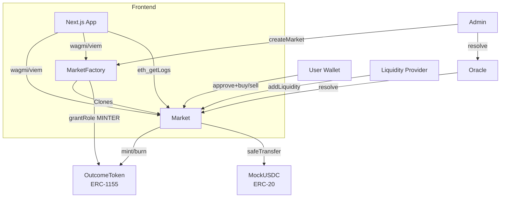

# Architecture

## High-level diagram

## On-chain flow

### Creating a market
1. Admin calls `factory.createMarket(question, ..., tradingDeadline, resolutionDeadline, feeBps)`
2. Factory creates a minimal-proxy clone of the `Market` implementation (EIP-1167)
3. Factory grants the new market `MINTER_ROLE` on `OutcomeToken`
4. Market is initialized with parameters and enters `Open` state

### Adding liquidity (first LP)
1. LP approves USDC and calls `market.addLiquidity(usdcAmount, minLpShares)`
2. Market mints `usdcAmount` YES + `usdcAmount` NO tokens to itself (the pool)
3. Sets `poolYes = poolNo = usdcAmount` (50/50 starting price)
4. LP receives `usdcAmount` LP shares (ERC-20)
5. USDC is held by the contract as collateral

### Buying YES with X USDC (after fee)
1. User approves USDC
2. Calls `market.buy(YES, X, minTokensOut)`
3. Market computes `fee = X * feeBps / 10000`, `netUsdc = X - fee`
4. Mints `netUsdc` YES + `netUsdc` NO (backed by `netUsdc` USDC; fee stays as extra collateral)
5. Pushes `netUsdc` NO into the pool: `poolNo += netUsdc`
6. CPMM gives back `extraYes = poolYes - k/poolNo_new`
7. User receives `netUsdc + extraYes` YES tokens
8. Pool state: `poolYes -= extraYes`, `poolNo += netUsdc`

### Selling YES for `R` USDC (gross)
1. User approves OutcomeToken (ERC-1155 `setApprovalForAll`)
2. Calls `market.sell(YES, R, maxTokensIn)`
3. Direct formula: `tokensIn = k/(poolNo - R) - poolYes + R`
4. User sends `tokensIn` YES tokens to the market
5. Market swaps `tokensIn - R` YES → `R` NO via CPMM (`poolYes += swap`, `poolNo -= R`)
6. Burns `R` YES + `R` NO (one complete set) → releases `R` USDC
7. Subtracts fee, pays user `R - fee` USDC

### Resolution & redemption
1. After `tradingDeadline` passes, `state` transitions from `Open` to `Closed` automatically
2. Oracle (or RESOLVER_ROLE holder) calls `oracle.resolve(market, winningOutcome)`
3. Market enters `Resolved` state, `winningOutcome` is locked
4. Winning-token holders call `market.redeem()` — burn winning tokens, get 1:1 USDC
5. LPs call `market.lpRedeemAfterResolution(lpShares)` — burn LP shares, get proportional pool tokens, market burns winning ones for USDC, losing ones discarded

## Invariants

| Invariant | Where enforced |
|-----------|----------------|
| `totalYesOutstanding == totalNoOutstanding == totalUsdcCollateral` | Always paired mint/burn in `Market` |
| `poolYes * poolNo = k` (modulo rounding) | CPMM math in `buy`/`sell` |
| `poolYes ≥ MIN_POOL_BALANCE && poolNo ≥ MIN_POOL_BALANCE` | `removeLiquidity` revert check |
| Only oracle can resolve | `onlyOracle` modifier |
| State transitions: Open → Closed → Resolved (one-way) | `_checkOpen`, `resolve` checks |

## Frontend architecture

The dApp is **fully client-side**:
- Wagmi + viem for chain reads/writes
- TanStack Query for caching (10s polling on market state)
- `eth_getLogs` for trade history → reconstruct price chart locally
- RainbowKit auto-injects Arc Testnet as a custom chain

No backend, no API routes, no subgraph. The frontend is statically exportable.

## Trade-offs vs. Polymarket / Gnosis CTF

This implementation is intentionally simpler than production prediction markets:

- **One condition per market** (no parent-child conditions or position-id splitting)
- **Owner-only oracle** (production uses UMA Optimistic Oracle)
- **No order book** (CPMM only — production uses CPMM + CLOB hybrid)
- **No fee splits** between LPs / protocol / referrers (all to LPs)
- **No KYC / geofencing** (testnet only)

These are documented in [security.md](security.md).
